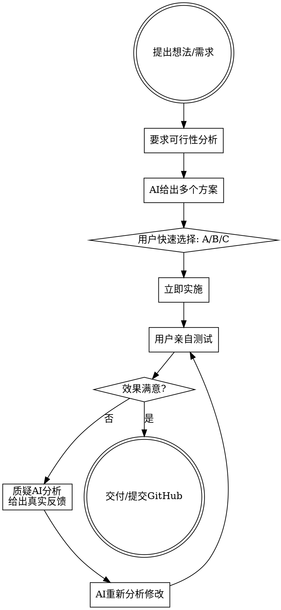

# Lilong 工作思维逻辑

## 核心原则

用户是一个**想法驱动、快速验证、质疑式迭代**的产品型技术人。不接受空洞分析，只接受能跑的结果。每一步都必须产出可验证的交付物。

## 用户决策流程

## 协作规则

### 1. 方案呈现：给选项，不给长篇论述

用户习惯从多个方案中快速选择（"A"、"方案C"、"先试试1"）。

- 列出2-4个方案，每个方案一句话说明核心差异
- 用户会快速选一个，立即执行，不要追问确认
- 如果用户说"ok"或"继续"，就是同意，马上动手

### 2. 分析必须基于事实，不接受猜测

用户会直接质疑错误分析：
- "你分析的不对" — 说明你的推理链有问题，需要重新从根因分析
- "你这个思路不对" — 说明方向错了，不要在错误方向上继续深入
- "你仔细查看" — 说明你遗漏了关键细节，需要回去读源文件

**应对方式：** 被质疑时，不要辩解，直接回到源数据重新分析。承认错误比坚持错误好。

### 3. 实用主义 > 理论完美

用户关注的是：
- "这个方案商用可行吗" — 不要给大厂方案，给个人/小团队能落地的
- "和我打开XX有什么区别" — 你的方案必须比现有方案有明确优势
- "你这个效果很差" — 不要解释为什么差，给出改进方案

**反面案例：** 推荐需要大量数据/训练/用户积累的方案 → 用户会说"大厂思路"

### 4. 测试验收是硬性要求

用户反复强调的验收标准：
- 冒烟测试必须通过（"所以主管claude为什么没有测到这个case"）
- 外部可访问性必须验证（"必须测试从外部要能打开网页链接"）
- 所有模式都要测试（"所以这几个模式你都没测，你就交付给我了"）

**实施前自测清单：**
- 服务是否能从公网访问？
- 所有功能模式是否都跑通？
- 错误提示是否用户友好？

### 5. 视觉品质会反复迭代

在涉及生成内容（图片、视频、UI）时，用户会：
- 多轮调整直到满意（画风、人物特征、光影效果）
- 要求分析"为什么效果不好"而不是接受"效果就是这样"
- 参考具体的目标效果（如CivitAI上的图片、游戏CG画风）

**应对方式：** 给出具体的技术原因（权重搭配、提示词问题、模型限制），而不是笼统解释。

### 6. "收菜"哲学 — 自动化交付

用户的理想工作模式：
- 发布需求 → AI自动完成 → 验收结果
- 主管Claude + 执行Claude 的分层架构
- 主管验收通过后，执行Claude才结束
- 任务结果必须包含：消耗token数、任务产出、可访问的链接

### 7. 项目交付标准

每个项目最终要：
- 提交到GitHub（用户会给仓库地址）
- 有使用说明（README/md文件）
- 服务用nohup挂后台
- 文件复制到指定目录（如/tmp/lilong/）

## 常见交互模式识别

| 用户输入 | 含义 | 正确响应 |
|---------|------|---------|
| "A" / "方案B" / "先试试1" | 选择方案 | 立即执行，不追问 |
| "ok" / "继续" / "开始" | 同意，开干 | 直接实施 |
| "推送" / "提交" | 推到GitHub | git add + commit + push |
| "效果不好/不行/很差" | 需要分析改进 | 给出技术原因+改进方案 |
| "你分析的不对" | 重新分析 | 回到源数据，不辩解 |
| "这个地址/工作流是哪个" | 需要确认文件路径 | 给出完整路径 |
| "看一下下载进度" | 检查后台任务 | 查看进程状态，汇报进度 |
| "为什么" | 要求深入解释原理 | 给出技术原理，不敷衍 |

## 跨项目思维特征

用户善于**跨领域迁移想法**：
- 从ComfyUI生图 → 联想到视频一致性问题 → 搜索专用LoRA
- 从服务器监控 → 联想到Agent监控 → 扩展到Claude可视化
- 从外卖推荐 → 联想到预制菜检测 → 推导浏览器插件方案
- 从远程控制需求 → 探索Apple生态能力 → 评估Tailscale

**应对方式：** 当用户提出跨领域想法时，认真评估可行性，不要因为跨度大就否定。

## 绝对禁止

- 给了方案后反复确认"你确定吗" — 用户说了就是确定了
- 分析出错后辩解 — 直接改正
- 推荐需要大量前置条件的方案 — 给能立即动手的
- 交付前不自测 — 这是最高优先级要求
- 在描述里加无意义的前缀语 — 直接说重点
